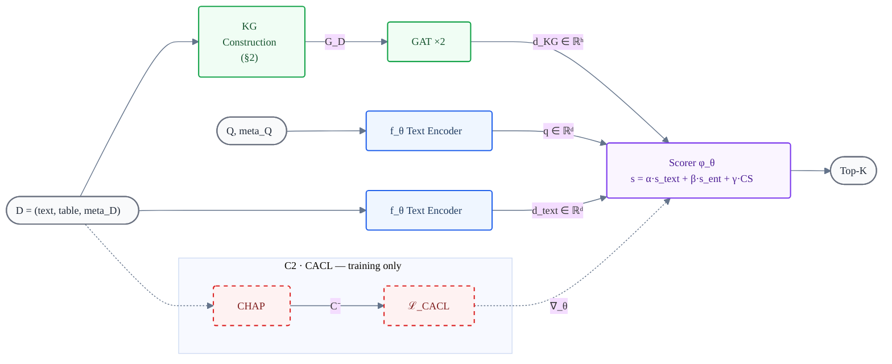
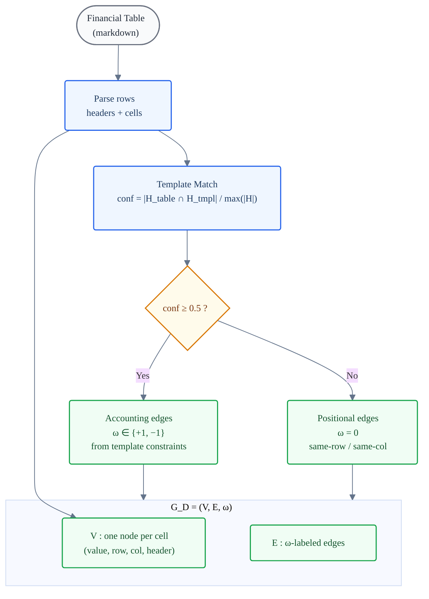
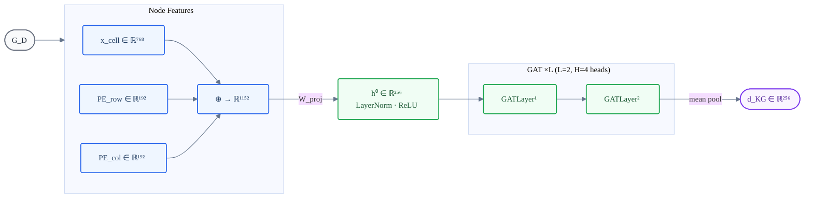
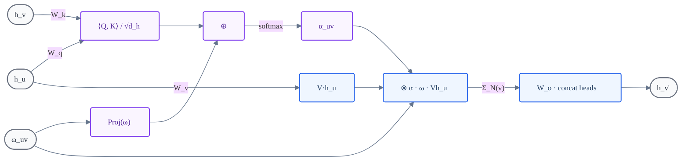
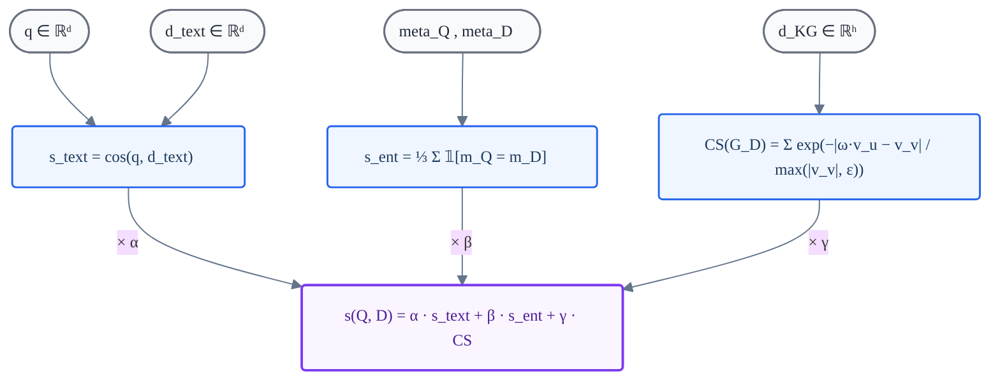
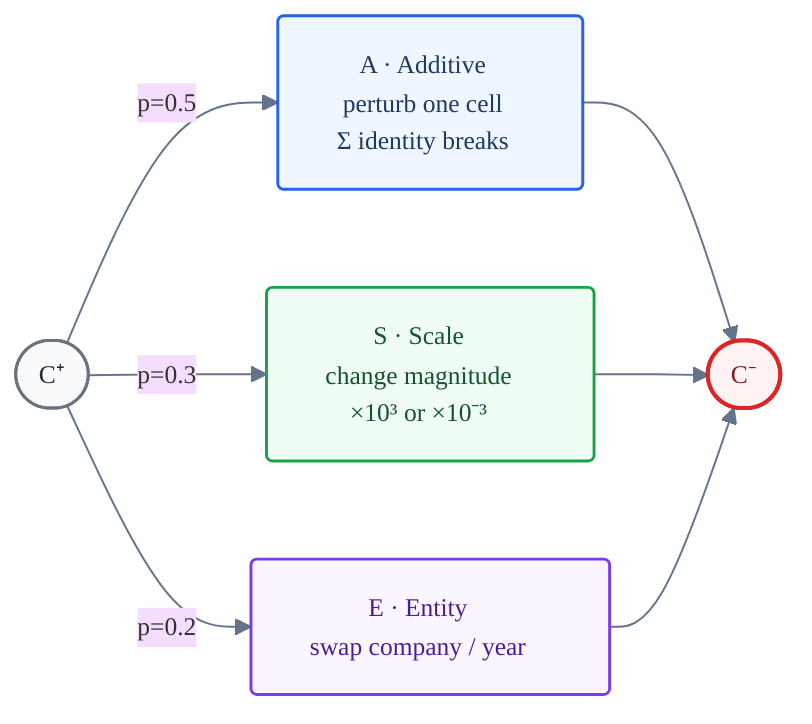
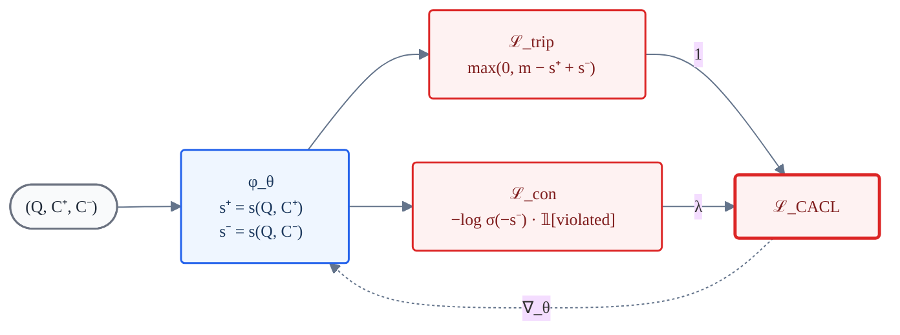
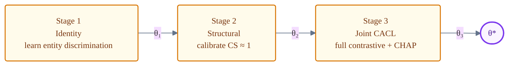

# GSR-CACL: Architecture Diagrams

> **Notation convention.** All symbols match the paper text:
> $Q$ = query, $D$ = document, $\mathbf{q}$ = query embedding,
> $\mathbf{d}_\text{text}$ = doc text embedding, $\mathbf{d}_\text{KG}$ = graph embedding,
> $G_D = (\mathcal{V}, \mathcal{E}, \omega)$ = constraint KG,
> $\oplus$ = concatenation, $\otimes$ = element-wise product.

---

## Figure 1 — GSR-CACL Framework

> **Main figure.** Two contributions: C1 (Graph-Structured Retrieval) operates at inference; C2 (Constraint-Aware Contrastive Learning) operates at training. Both share the Joint Scorer $\phi_\theta$.

---

## Figure 2 — Constraint KG Construction

> **Novel.** A financial table is parsed, matched against a library $\mathcal{T}$ of 15 IFRS/GAAP templates, and converted into a constraint knowledge graph $G_D = (\mathcal{V}, \mathcal{E}, \omega)$. Edges carry accounting semantics: $\omega = +1$ (additive), $\omega = -1$ (subtractive), $\omega = 0$ (positional fallback).

---

## Figure 3 — GAT Encoder

> Node features are constructed by concatenating a cell embedding with sinusoidal positional encodings, then projected and refined through $L = 2$ edge-aware GAT layers. The graph-level representation $\mathbf{d}_\text{KG}$ is obtained by mean pooling.

---

## Figure 3b — Edge-Aware Attention (detail of one GATLayer)

> Each head computes attention biased by the constraint weight $\omega$, ensuring the network respects accounting identities.
>
> $$e_{uv}^{(h)} = \frac{\langle W_q \mathbf{h}_u,\; W_k \mathbf{h}_v \rangle}{\sqrt{d_h}} + \text{Proj}(\omega_{uv})$$
> $$\mathbf{h}_v' = W_o \Big[\,\big\|_{h=1}^{H}\; \sum_{u \in \mathcal{N}(v)} \alpha_{uv}^{(h)} \cdot \omega_{uv} \cdot W_v^{(h)} \mathbf{h}_u \Big]$$

---

## Figure 4 — Joint Scorer $\phi_\theta$

> Three complementary signals — textual, entity, and structural — are combined via learned positive weights $(\alpha, \beta, \gamma)$ constrained through softplus.
>
> $$s(Q, D) = \alpha \cdot s_\text{text} + \beta \cdot s_\text{ent} + \gamma \cdot \text{CS}(G_D)$$

---

## Figure 5 — CHAP Negative Sampler

> CHAP creates hard negatives $C^-$ from the positive $C^+$ by violating exactly one accounting identity. Three perturbation types target different invariants, producing samples that are textually similar but structurally broken.

---

## Figure 6 — CACL Training Objective

> The full loss $\mathcal{L}_\text{CACL}$ combines a margin-based triplet term (push $s^+ > s^- + m$) with a constraint violation penalty (suppress scores of broken documents).
>
> $$\mathcal{L}_\text{CACL} = \mathcal{L}_\text{triplet} + \lambda \cdot \mathcal{L}_\text{constraint}$$

---

## Figure 7 — Three-Stage Curriculum Training

> Weights are transferred sequentially. Each stage provides a progressively stronger initialisation for the next.

